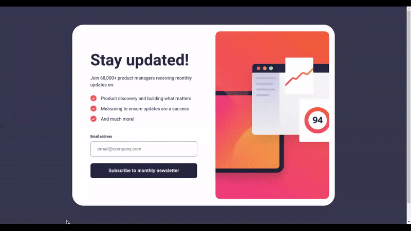

# Frontend Mentor - Newsletter sign-up form with success message solution

This is a solution to the [Newsletter sign-up form with success message challenge on Frontend Mentor](https://www.frontendmentor.io/challenges/newsletter-signup-form-with-success-message-3FC1AZbNrv). Frontend Mentor challenges help you improve your coding skills by building realistic projects.

## Table of contents

- [Overview](#overview)
  - [The challenge](#the-challenge)
  - [Solution's demo](#solutions-demo)
  - [Links](#links)
- [My process](#my-process)
  - [Built with](#built-with)
  - [What I learned](#what-i-learned)
  - [Useful resources](#useful-resources)
- [Author](#author)
- [Acknowledgments](#acknowledgments)

## Overview

### The challenge

Users should be able to:

- Add their email and submit the form
- See a success message with their email after successfully submitting the form
- See form validation messages if:
  - The field is left empty
  - The email address is not formatted correctly
- View the optimal layout for the interface depending on their device's screen size
- See hover and focus states for all interactive elements on the page

### Solution's demo



### Links

- [My live site on GitHub Pages](https://alberto-rj.github.io/newsletter-sign-up-with-success-message/)
- [My solution on Frontend Mentor](https://www.frontendmentor.io/solutions/animated-newsletter-signup-form-mriIaG8Yk1)

## My process

### Built with

- Semantic HTML5 markup
- CSS custom properties
- Flexbox
- CSS Grid
- CSS animation properties
- Mobile-first workflow
- Vanilla JavaScript (DOM)

### What I learned

- `novalidate`: I used the `novalidate` attribute on the `form` element to prevent the browser from validating the `form` by default.

- `role="alert"`, `aria-live="polite"`, `aria-describedby` and `aria-invalid`: I used these to make the error message accessible for screen reader users.

- **Constraint validation API**

  - **HTML:** We can use various attributes of form elements (`input`, `textarea`) to implement validation. Some of the attributes I liked are:  
    - `minlength`, `maxlength`
    - `min`, `max`
    - `pattern`
    - `required`
  
  - **CSS:** We can use various pseudo-classes in CSS if we want to implement form styling based on validation. Some pseudo-classes I found interesting are:

    ```css
    input:valid {
      /* Styles for the valid input */
    }

    input:invalid {
      /* Styles for the invalid input */
    }
    ```

  - **JavaScript:** We can use the properties of the `ValidityState` object if we want to control the validation of our form using JavaScript. An example of accessing the `ValidityState` object in a fictional input could be:

    ```js
    console.log(emailField.validity);
    /* Output
    {
      badInput: false,
      customError: false,
      patternMismatch: true,
      rangeOverflow: true,
      rangeUnderflow: false,
      stepMismatch: false,
      tooLong: false,
      tooShort: true,
      typeMismatch: false,
      valid: false,
      valueMissing: true
    } 
    */
    ```

### Useful resources

- [Client-side form validation](https://developer.mozilla.org/en-US/docs/Learn/Forms/Form_validation) - This MDN article provides a good overview of how to implement your own form validations using JavaScript. I highly recommend it for those starting to learn about this topic.

- [Constraint validation](https://developer.mozilla.org/en-US/docs/Web/HTML/Constraint_validation) - Specification of the client-side form validation API, great when you need more details to carry out your own validations.

- [Test your skills](https://developer.mozilla.org/en-US/docs/Learn/Forms/Test_your_skills:_Form_validation) - These excellent MDN tests can help you practice client-side form validation using JavaScript.

## Author

- GitHub - [@alberto-rj](https://github.com/alberto-rj)
- Frontend Mentor - [@alberto-rj](https://www.frontendmentor.io/profile/alberto-rj)
- Twitter - [@albertorauljose](https://www.twitter.com/albertorauljose)

## Acknowledgments

Thank you very much [Grace Snow](https://www.frontendmentor.io/profile/grace-snow) for the great suggestions you provided. They were useful because they helped me to significantly improve this solution, especially in terms of accessibility and performance.
